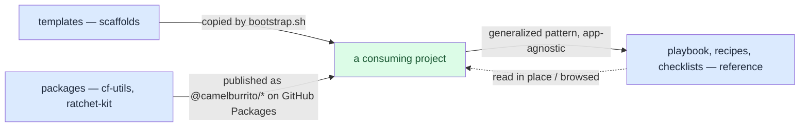
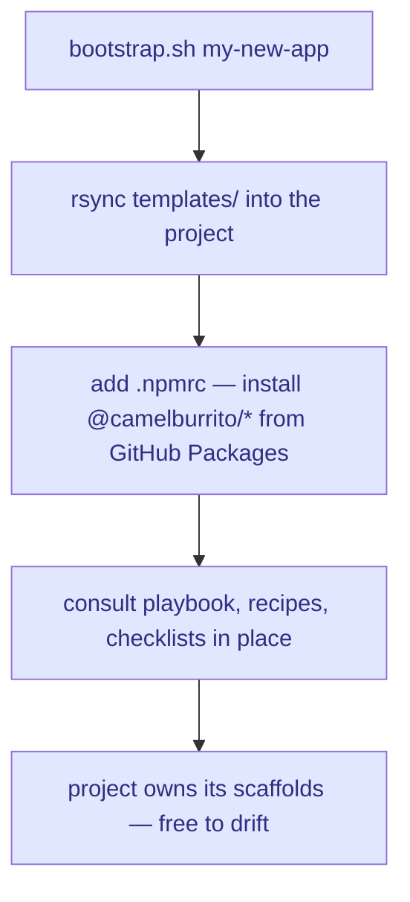
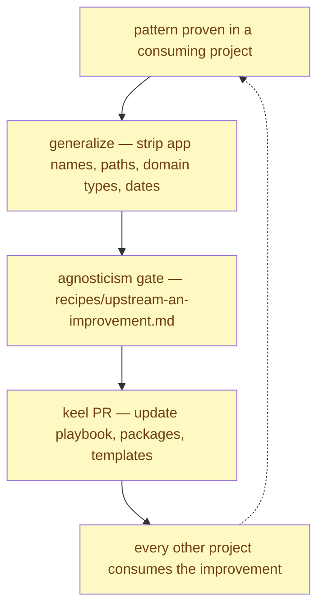

# The baseline and its consumers

**Status:** stable
**Last updated:** 2026-06-21

keel is a **standalone, app-agnostic engineering baseline** — a playbook, a set of scaffolds, and two vendored packages that every new production project starts from. It names no downstream project; any app, current or future, is just a consumer. A project draws from keel three ways — its `templates/` scaffolds **copied** in at bootstrap, its `packages/` **published** and installed as versioned dependencies, and its playbook, recipes, and checklists **read as reference** — and improvements flow **back** into keel through an agnosticism gate that strips every app-specific identifier before a pattern is generalized. This doc maps how those pieces fit and how patterns flow both directions.

## The artifact layers

keel is six top-level directories plus a bootstrap entry point. Each layer has one job and one distribution mechanism (copied, published, or reference — see the next section).

- **`docs/playbook/`** — methodology docs, one per system (auth, design system, CI/CD, observability, testing, ratchets, …). Each captures the *why*, the structural assertions a project must satisfy, and the generic shape of the pattern. Indexed by [`docs/playbook/00-index.md`](../playbook/00-index.md). **Reference** — read in place / browsed on GitHub.
- **`packages/`** — the only executable, truly-agnostic code, published to GitHub Packages as `@camelburrito/<pkg>`. Two packages today: `cf-utils` (a logger with a layered PII-redaction pipeline, plus `writeWithAudit`, idempotency, rate-limit, and validation helpers) and `ratchet-kit` (shared helpers + a library of configurable strict-zero ratchet templates, exported from `packages/ratchet-kit/src/index.ts`). **Published**, not copied.
- **`templates/`** — empty scaffolds copied into a new project: POSIX-bash githooks, a deny-all `firestore.rules`, base `tsconfig.json` / `eslint.config.js` / `vitest.config.ts`, parametrized GitHub Actions workflows, a `templates/scripts/` and `templates/docs/` tree, and the architecture-doc authoring contract [`templates/_AUTHORING.md`](../../templates/_AUTHORING.md). **Copied** at bootstrap.
- **`recipes/`** — task-shaped "how to add X" guides (a ratchet, an architecture doc, a Cloud Function, a locale, an environment), plus [`recipes/upstream-an-improvement.md`](../../recipes/upstream-an-improvement.md), the contribution gate. **Reference**.
- **`checklists/`** — pre-merge, pre-deploy, and pre-launch checklists. **Reference**.
- **`scripts/`** — keel's own build/CI/audit scripts (a local-CI mirror skeleton, codegen, a PII-log auditor, the mermaid render check). **Reference** — a project gets its own scaffolded scripts from `templates/scripts/`, not from here.
- **`bootstrap.sh`** — the entry point that stamps a new project (it rsyncs `templates/`).

## How a project consumes keel

Three mechanisms, chosen per layer by how the artifact is meant to evolve.

**Copy** (`templates/` only). At bootstrap, `bootstrap.sh` rsyncs `templates/` into the new project — githooks, base configs, parametrized workflows, and the `templates/scripts/` + `templates/docs/` skeletons. A project's copy is **allowed to drift** — it owns its scaffolds and edits them freely. This is right for artifacts a project must own and customize.

**Publish** (`packages/` only). The two packages are installed as versioned dependencies from GitHub Packages, so a project picks up fixes with a normal version bump and never forks the logic. This is right for code whose correctness is shared — a PII-redaction pipeline or a ratchet implementation should improve everywhere at once, not drift per-project.

**Reference** (playbook, recipes, checklists, the top-level scripts). These are **not** stamped into a project — the bootstrap output points you to them, and you read them in place or browse them on GitHub, copying a specific piece by hand only if you want to adapt it. This keeps the methodology a living, single-source document rather than N drifting forks.

## The upstreaming loop

keel does not accumulate patterns speculatively. A pattern earns its place by being **proven in a real consuming project first**, then generalized back. The loop:

The **agnosticism gate** at [`recipes/upstream-an-improvement.md`](../../recipes/upstream-an-improvement.md) is the load-bearing step: it is a strip-list (app names, file paths, domain types, PR/phase numbers, date codes, legacy terms) that a pattern must pass before it is generalized into keel. General-purpose tools a pattern depends on (Firebase, Playwright, Stitch, mermaid) are named freely; the consuming app behind the pattern is never named.

A consuming project enforces the **reverse** direction with its own `playbook-coverage-on-new-architecture` ratchet: adding a new architecture doc there without a matching keel playbook entry trips the gate, so significant new subsystems can't ship downstream without flowing their pattern up.

## Core invariants

- **No downstream identifiers anywhere in keel.** The whole baseline is generic — no app name, no app-specific path or domain type. Enforced procedurally by the agnosticism gate ([`recipes/upstream-an-improvement.md`](../../recipes/upstream-an-improvement.md)) and by review. A leak here defeats keel's reason to exist: the next project bootstrapped from it would inherit another app's vocabulary.
- **Patterns are descriptive, not aspirational.** A playbook entry or package ships only after the pattern is proven in production. keel documents what works, not what might.
- **Shared-correctness code is published; ownable artifacts are copied.** Logic whose correctness is common (packages) flows by version bump so it improves everywhere at once; scaffolds a project must customize (templates, playbook) are copied and allowed to drift.
- **keel's own architecture docs are self-validated.** The docs under `docs/architecture/` are gated by the same `archDocIntegrity` ratchet keel ships — keel eats its own dog food. See the runbook below.

## Pitfalls

- **Upstreaming with app-specific identifiers.** A pattern copied up with a downstream name, path, or domain type still in it silently re-introduces app vocabulary into the generic baseline. *Defense:* the agnosticism gate's strip-list, run before generalizing — and a leak sweep that reads results from a file rather than trusting compressed grep stdout (compressed terminal output can drop matching lines, hiding a straggler).
- **A clean heuristic ratchet is not a rendered diagram.** `archDocIntegrity` text-scans for known mermaid traps; it cannot prove a diagram renders. Diagrams have shipped broken past a green ratchet. *Defense:* `scripts/check-mermaid-render.mjs` runs every block through the real engine — run it alongside the ratchet, and ground any new trap rule against the real parser before encoding it.
- **Documenting the current tree but not the history.** Making a once-app-specific repo public exposes its full commit history, not just the current files — a tree scrubbed clean can still carry app names in old commit messages. *Defense:* audit history (not just `HEAD`) before publishing; reset history to a clean root commit when the past can't be exposed.

## Interactions with the playbook

- [`docs/playbook/04-architecture-docs.md`](../playbook/04-architecture-docs.md) — the architecture-doc convention these very docs follow (the three-tier drift defense; when to split a doc).
- [`templates/_AUTHORING.md`](../../templates/_AUTHORING.md) — the authoring contract: the four principles and the pre-PR checklist.
- [`recipes/upstream-an-improvement.md`](../../recipes/upstream-an-improvement.md) — the agnosticism gate that governs the upstreaming loop above.

## Self-validation runbook

keel applies its own arch-doc gate to the docs in this directory:

- **Structural integrity** — `node scripts/check-arch-docs.mjs` runs `archDocIntegrity` from `@camelburrito/ratchet-kit` over `docs/architecture/*.md`: every relative link and `#anchor` resolves, every fully-qualified inline-code path exists on disk, mermaid carries no GitHub-renderer traps, and each doc (except the index) has a `Last updated` footer. The package's `dist/` is gitignored, so CI builds `packages/ratchet-kit` before running the script.
- **Real mermaid render** — `node scripts/check-mermaid-render.mjs 'docs/**/*.md'` renders every diagram through the real engine, catching the parse-aborting and dark-mode-illegible cases the heuristic can't. Already wired for all of `docs/` by [`.github/workflows/check-docs-mermaid.yml`](../../.github/workflows/check-docs-mermaid.yml).

Bootstrapping and publishing (the consumer-facing side) live in [`README.md`](../../README.md): `bootstrap.sh my-new-app` to stamp a project, and a package's own `npm publish` to GitHub Packages to ship a fix to all consumers.

---

**Last updated:** 2026-06-21 — initial keel self-architecture doc (dogfoods the `04-architecture-docs.md` convention).
