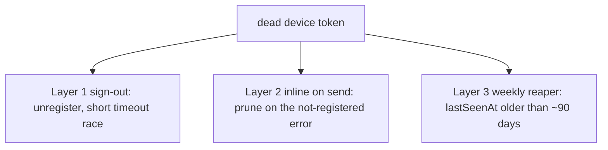
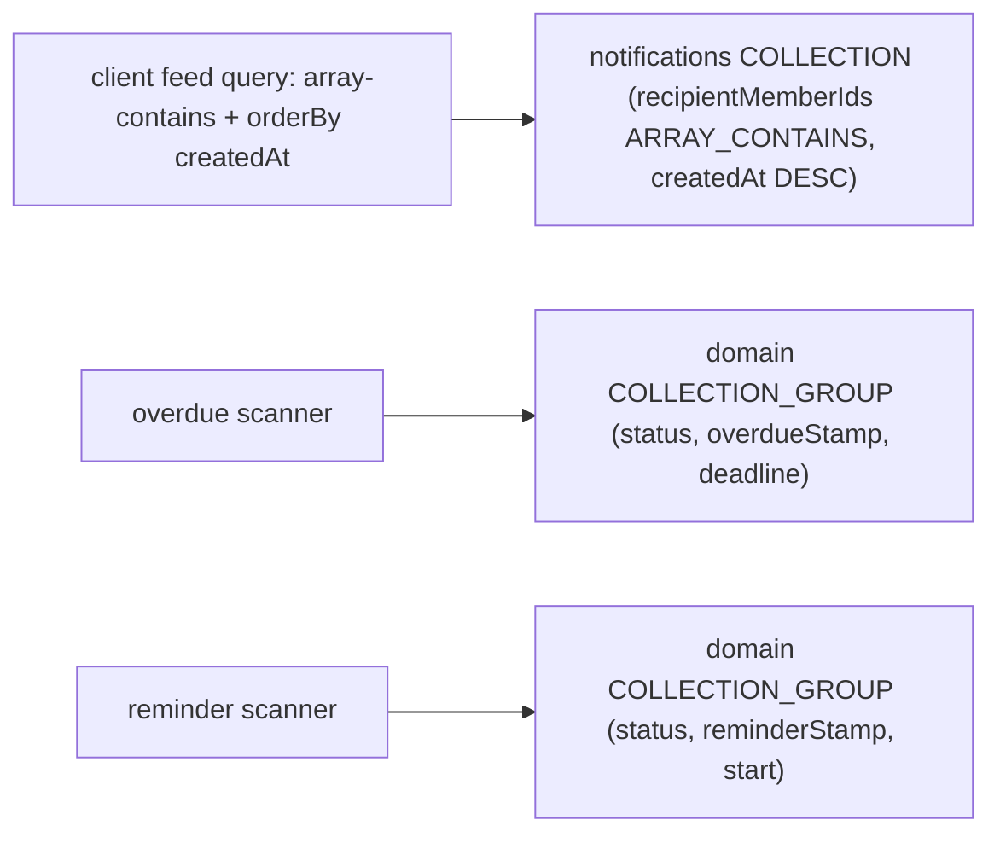

# 12 — Notifications (in-app feed + push + widgets)

**Status:** 🟢 drafted
**Reference impl:** `chorz/docs/architecture/notifications.md`, `chorz/shared-cf-utils/src/notifications/`, `chorz/functions-calendar/src/notifications/`, `chorz/firestore.indexes.json`, `chorz/firestore.rules`, `chorz/packages/ChorzCore/Sources/ChorzCoreMessaging/`, `chorz/apple/Chorz/ChorzWidgets/`

---

## Why this exists

A product that wants to tell a user "something happened" needs three surfaces that are usually built ad-hoc and drift apart: a durable in-app feed, an OS push, and (on mobile) a widget. The keel pattern unifies them behind **one dispatcher abstraction** and **one fan-out-on-write document**, so adding a new notification kind is a payload change — not a new delivery path, a new rule, and a new index each time. It also names the single scaling frontier (fleet-wide scheduled scanners) up front, so the next project doesn't discover it in production.

## The principle

**The in-app feed is durable; the push is a best-effort courtesy.** Everything else is a consequence of holding that line. One transactional write produces the source-of-truth feed doc; a push rides along *after* commit and is allowed to fail silently. You never get a push without a feed record behind it, and you never roll back a feed record because a push died.

The corollary is that **a notification is one document, not one-per-recipient.** Fan-out is an array field. This is what makes the per-event cost O(1) and pushes the only real scaling pressure onto the fleet-wide scanners — named in § 8 so you can see it coming.

## What you must satisfy

These are the load-bearing claims. Get these right and the rest is detail.

- **Fan-out-on-write to ONE document, not one-per-recipient.** A notification is a single doc carrying `recipientMemberIds: string[]` plus per-viewer `readBy[]` / `dismissedBy[]` arrays. This makes the per-event write cost O(1) regardless of fan-out size, avoids hot-doc contention (each is a fresh auto-id doc), and bounds the per-viewer arrays by group size. Resist the "one doc per recipient" instinct — it multiplies writes and index entries by N for no benefit at family/team scale.
- **The in-app feed is the source of truth; push is a best-effort courtesy.** Deliver via a frozen, ordered dispatcher registry where the durable-feed adapter is registered FIRST and runs inside the write transaction, and the push adapter runs in a post-commit side-effect phase whose failures are logged and swallowed. Consequence: a transaction abort delivers nothing on any channel; a push never fires for a notification that didn't persist; a dead push never rolls anything back.
- **Scheduled producers stamp-before-dispatch under a transactional re-read.** Any polled scanner (reminders, overdue) must re-read the candidate inside a transaction, bail if the state changed, write a one-per-lifetime idempotency stamp, and only then dispatch. This is at-most-once: a dispatch failure after the stamp loses that one push permanently, which is correct (the alternative re-spams every cycle) as long as the underlying state is also derivable in the UI.
- **The `== null` query trap is real.** Firestore `where(field, '==', null)` does not match *missing* fields. Any field a scanner filters on (the idempotency stamp) must be initialized at create time and backfilled for the existing corpus, or the scanner silently matches zero rows.
- **Opt-out is server-enforced, not just client-hidden.** A single `optIn` boolean with opt-OUT semantics (only explicit `false` suppresses) gated inside the push adapter — so opting out on one device silences every channel including the widget cache. A client must not be reachable against an explicit opt-out.
- **Cross-tenant isolation is a rule conjunct, not an app-layer filter.** The feed read rule ANDs a `token.tenantId == <path tenant>` (your tenant claim) condition, so knowing another tenant's notification ID still denies the read. All writes are CF-only (`write: false`); clients never write the feed doc.
- **Tokens self-heal on three layers.** Per-device token registry with a `lastSeenAt`; clean up on sign-out, inline on send-error (`registration-token-not-registered`), and on a weekly reaper at the platform's stale-token TTL (~90 days). Never trust a token to be live.
- **Widgets duplicate a Lite Codable shape rather than link the full core.** The widget extension's memory cap (~30 MB on iOS) won't hold the Firebase graph, so the extension reads a small app-group cache written by the host app and decodes a duplicated "Lite" struct — kept honest by a contract test against shared golden fixtures, never by trust.
- **One projected presentation contract, mirrored per platform, pinned by golden fixtures.** The card shape is projected once (already-localized title/body, already-formatted relative time, per-viewer `isRead`) and mirrored byte-for-byte across web + native (+ widget Lite copy), with the fixtures as the single source of truth. Same discipline as your card-projector contract.

---

## 1. The dispatcher port/adapter + 3-phase composer

The delivery mechanism is a port/adapter pattern in your CF utils package. A producer never talks to the feed store or the push vendor directly — it builds a payload and calls one composer. Adding a delivery channel (email, SMS, a second push vendor) is a new adapter in the registry, not a change to every producer.

**The port** is a three-method contract every channel implements:

- `accepts(payload, ctx)` — a pre-transaction gate: *can this channel deliver this payload?* The push adapter does its recipient-token resolution here, so it can answer "do I have anyone to push to?" and memoize the tokens for later phases.
- `dispatch(payload, txn, ctx)` — the in-transaction write share, run inside the composer's single transaction. The feed adapter does exactly one `txn.set` of the feed doc; the push adapter has nothing to write transactionally (it only warms its token cache).
- `deliverPostTransaction(payload, ctx)` — an optional best-effort side effect that runs **only if the transaction commits**. The push adapter fires here.

**The composer** runs three phases over a frozen, ordered registry:

```ts
REGISTERED_DISPATCHERS = Object.freeze([ FeedDispatcher, PushDispatcher ])
```

1. **Collect.** Call `accepts()` on each dispatcher. The push adapter resolves device tokens here and memoizes the result on payload identity (a module `WeakMap`) so the reads aren't repeated in later phases.
2. **One transaction.** Open a single transaction and call each accepting dispatcher's `dispatch()`. The feed adapter writes the doc; the push adapter is a no-op write.
3. **Post-commit side effects.** For each dispatcher, `await deliverPostTransaction()` inside a **per-dispatcher try/catch**. The push adapter fires the multicast here. Failures are logged and **swallowed** — the feed doc is the durability record, so a dead push never rolls anything back.

### Why the order matters

The feed adapter is registered **first**, and two guarantees fall out of that placement:

- A transaction abort prevents *any* push send — you can never get a push with no durable feed record behind it.
- The push fires *after* commit — a recipient can never receive a push for a notification that didn't actually persist.

This is the at-least-once-feed / at-most-once-push split. The feed is reliable; the push is a courtesy. The frozen registry is not cosmetic: register the push adapter first and you've inverted the guarantee.

> **Reference impl:** chorz's `dispatchNotification` composer over `[FirestoreFeedDispatcher, FcmDispatcher]` in `shared-cf-utils/src/notifications/`.

---

## 2. Producers: event-driven triggers vs polled scanners

Producers fall into two shapes, and the shape dictates the delivery semantics. **Both route through the same composer** — a producer's only job is to build the payload and resolve recipients.

### Event-driven (document triggers)

A change to a domain doc fires a trigger that fans out immediately. Examples: an assignment trigger (a doc gains an assignee → notify the assignee), a state-diff trigger (a field grows in a way that matters → notify admins). These are exactly-as-reliable as the trigger platform: at-least-once, and you dedupe on the consequence (the feed doc), not the trigger.

Keep these *narrow*. A trigger that fans out to "the whole admin set" reads the entire member collection per fire — bounded by group size, fine at family/team scale, but it's an O(members) read you should be aware of.

### Polled (scheduled scanners)

Time-relative notifications (a reminder N minutes before a deadline, an overdue alert N minutes after) can't be trigger-driven — nothing writes the doc when wall-clock time crosses the threshold. A scheduled job sweeps the fleet on a fixed cadence, queries the candidates via an index-backed `collectionGroup` query, and loops them serially.

Two facts about scanner windows:

- **The query window should be narrower than the cadence** so a candidate can't be matched twice across adjacent cycles before it's stamped. A reminder scanner running every 15 min might match `start in [now+55m, now+65m]` — a 10-minute window. The trade-off: a candidate landing in the inter-window gap gets no notification. Best-effort by construction; document it.
- **The query is cheap; the per-candidate work is the cost.** The index returns only the small per-cycle flux. The binding constraint is the serial `txn + reads + dispatch` per candidate under the CF timeout (see § 8).

### The at-most-once idempotency-stamp contract

The scanners **stamp before they dispatch**, inside a transaction:

```text
scan, per candidate:
  txn:
    re-read the state the candidate was matched on   # race guard
    if state changed OR already stamped  ->  bail
    writeWithAudit: stamp = now                       # one-per-lifetime
  dispatch(...)                                        # may fail; never retried
```

The transactional re-read defends against a concurrent state change (someone resolved the condition between query and write) and against a second worker. The stamp is written **once per candidate lifetime and never cleared**, so the candidate drops out of every subsequent scan — this is what keeps the steady-state matched set small.

The consequence: if `dispatch` fails *after* the stamp lands, that one push is **permanently lost**. This is deliberate — the alternative (retry until delivered) re-spams every cycle. It is *only* acceptable because the underlying state is **also derivable in the UI** (the overdue item renders overdue on its own; the user is never blind, they just don't get a second ping). If your notification is the *only* surface for the information, you cannot use at-most-once — you need a retry queue with explicit dedup.

> **The `== null` trap, concretely.** A scanner that filters on its own stamp field (`where('stamp', '==', null)`) will not match documents where the field is *missing*. Initialize the stamp to `null` at create/spawn time, **and** run a one-time backfill over the existing corpus. Make the backfill support a `--mark-notified` mode that stamps already-eligible candidates to `now`, so the first scan after deploy doesn't fire a backlog storm.

---

## 3. Token lifecycle + 3-layer dead-token cleanup

A push needs a live device token. Store tokens on the **user/identity** doc (keyed on the auth identity), not the per-tenant member doc — a user signed into multiple tenants has one device, one token set.

```ts
identity/{uid}.deviceTokens?: TokenEntry[]
TokenEntry = { token, platform: 'web' | 'ios' | ..., registeredAt, lastSeenAt }
```

Multi-device by construction; the `platform` discriminator lets the dispatcher shape the payload per channel. Two write-shape rules earn their place:

- **Upsert by token value**, not append-blindly: replace-on-match (preserving `registeredAt`, bumping `lastSeenAt`) or append. Re-registration is constant, and append-blindly grows an unbounded duplicate set.
- **Use a client-side timestamp inside array elements.** Server-sentinel timestamps (`serverTimestamp()`) are illegal inside array elements — `lastSeenAt` must be a concrete `Timestamp.now()`. Tolerate any legacy bare-string entries by flooring their `lastSeenAt` to 0 (always stale).

Registration is a rate-limited onCall the client invokes after it mints a token (web via the push SDK + VAPID + service-worker registration, gated behind an opt-in toggle; native via the platform push bridge — see § 5).

### Three layers against dead tokens — never trust a token to be live



1. **Sign-out** — the client calls the unregister CF before tearing down auth, racing it against a short timeout so a hung callable can't strand sign-out.
2. **Inline, on send** — when the multicast reports `registration-token-not-registered` / `invalid-registration-token` for a token, the dispatcher immediately prunes that entry (one audited write per dead token, preserving the entry shape). This is the layer that catches most dead tokens — usually on the very next send.
3. **Weekly reaper** — a scheduled job prunes any entry whose `lastSeenAt` is older than the platform's stale-token TTL (~90 days). This is the backstop for tokens that die without ever being sent to again.

A dead token therefore survives at most ~TTL + one week, and usually far less.

---

## 4. The fan-out-on-write doc + indexes + tenant-isolation rule

### The feed document

```text
tenants/{tid}/notifications/{nid}            (auto-id)
  id: string                                  # mirrors doc id
  kind: NotificationKind                      # closed union
  recipientMemberIds: string[]                # fan-out happens HERE
  title, body                                 # already server-localized
  actorId                                     # 'system:<fn>' or 'user:<uid>'
  related?, diff?                             # kind-specific payload
  createdAt
  readBy: string[]                            # per-viewer state, on the shared doc
  dismissedBy: string[]                       # per-viewer state, on the shared doc
```

Per-viewer read/dismiss state lives as `readBy[]` / `dismissedBy[]` **arrays on the one shared doc**, not as separate per-recipient docs. Each array is bounded by the tenant's member count — single digits to low tens, nowhere near Firestore's 40k-element array ceiling. The receipt CFs (`markRead`, `dismiss`) array-union the viewer's id; idempotent by membership, not counters.

If the `kind` union is declared in more than one place (a CF-side type and a client-side type), **edit all copies atomically** — a drift here is a silent decode failure on one platform.

### The 2–3 composite indexes



The feed needs **one** composite (`recipientMemberIds ARRAY_CONTAINS, createdAt DESC`) for the client listener. Each scanner needs **one** `COLLECTION_GROUP` composite over `(matched-state, stamp, time-field)`. All must be declared in `firestore.indexes.json` and deployed **before** the feature works in production — the emulator auto-creates ad-hoc indexes, which masks a missing declaration locally. Guard the `COLLECTION_GROUP` queries with a ratchet (`no-unindexed-collectiongroup-query`) so a new scanner can't ship without its index.

### The tenant-isolation read rule

```text
tenants/{tid}/notifications/{nid}:
  read  = tenant-not-deleted AND (
            recipient arm:  token.tenantId == tid
                            AND token.memberId present
                            AND session fresh
                            AND token.memberId in resource.data.recipientMemberIds
            OR admin arm:   caller is an admin of tid )
  write = false                                # every mutation is CF-only
```

The `token.tenantId == tid` conjunct denies cross-tenant reads **even if a caller knows another tenant's notification ID** — isolation is a rule property, not an app-layer filter. `write: false` means clients never write the feed doc; all mutations route through the Admin SDK in CFs. Cover the rule with a describe block (recipient read, non-recipient deny, cross-tenant deny, client-write deny, stale-session deny, soft-deleted-tenant deny) so the `no-firestore-collection-without-rule-test` ratchet stays green.

### The opt-in gate

A single `Member.optIn?: boolean` with **opt-OUT semantics**: only an explicit `false` suppresses; `undefined`/`true` both mean deliver. Enforce it **server-side inside the push adapter** — skip any recipient whose member doc reads `optIn === false`, *before* any token read — so a member who opts out on one platform is silenced everywhere, including the widget cache (which writes an empty array when opted out). When a recipient resolves to **no tokens** (opted out, no identity link, or no usable tokens), emit a **structured skip log** (`recipient-skipped`) so the silent-skip case is observable — this is the observability that makes the incident in § 7 diagnosable.

---

## 5. Clients: feed listener, push bridge, widgets

### The real-time feed listener

One listener over `tenants/{tid}/notifications` (`recipientMemberIds` array-contains the viewer, `orderBy createdAt desc`, `limit ~20`). Maintain an id-keyed doc map, cursor-based load-more (one-shot read per page), and **centralize `dismissedBy[]` filtering in the listener hook** so the badge and the list can never disagree.

The unread badge is projected from the page-1 window only. Because Firestore has **no array-not-contains operator**, an exact server-side unread count is impossible — render `N` or `N+` (a floor past the window) and accept it as a design limit, or maintain a server-side counter (§ 8) if exact counts matter.

### The push bridge (platform swizzler gotchas)

Web is straightforward: mint via the push SDK (VAPID + service-worker), background delivery in the service worker, foreground delivery via the in-page message handler. Add a cross-tab display-claim (a short-TTL `localStorage` lock) so N unfocused tabs collapse to one banner; the focused tab shows none (the in-app bell covers it). Carry a `link` option on every multicast so SDK-displayed background banners deep-link to the feed on click.

Native (iOS) is the subtle part — these are the lines that don't show up in any test and only fail on a physical device:

- **Configure the Firebase app *before* touching messaging**, set the app delegate as both the notification-center delegate and the messaging delegate, and re-register for remote notifications each launch when already authorized (token-rotation re-sync).
- **Explicitly set the APNs token on the messaging SDK** in `didRegisterForRemoteNotificationsWithDeviceToken`. The push-SDK swizzler does **not** attach on the SwiftUI `@UIApplicationDelegateAdaptor` proxy, so without this line the APNs↔FCM link never forms and you get a token that can't be pushed to.
- **Foreground pushes need an explicit present handler** returning `[.banner, .list, .sound]` — without it the OS silently swallows pushes while the app is foregrounded.
- **Re-register on the auth edge** keyed on the resolved authenticated user id, to close the cold-launch race where the token callback fires before the keychain restores the signed-in user (see § 7).

### Widgets (app-group cache + a duplicated "Lite" Codable)

A widget extension **cannot link the full app core** — the platform push/data SDK's transitive graph (~22–36 MB) brushes the ~30 MB widget process memory cap. Use a **cache-and-duplicate model**: the host app writes a small JSON cache (≤10 rows, atomic write, opt-out → empty array) to a shared app group; the extension reads it and decodes a **duplicated `…Lite` Codable** that links only the design-system package, never the core.

The duplicate is a liability unless it's pinned: a contract test decodes the same golden fixtures (§ 6) into the Lite shape, so any drift between the canonical type and the Lite copy fails the test. The extension's timeline emits one entry with a fallback refresh policy (e.g. `.after(now + 30 min)`); the host app also reloads its timelines on every cache write (watch the reload budget — § 8).

---

## 6. The cross-platform presentation contract

Both feeds (and the widget) render through **one already-projected shape** — title, body, an icon name, an icon color as a raw value (design-system variables can't cross the projector boundary), an already-localized relative-time label, and a per-viewer `isRead` derived from `readBy[]` at read time. Unlike a card projector that derives *from* raw data, this struct **is** the projection: `createdAtText` and `isRead` are computed upstream, and `title`/`body` are localized **server-side by the producer** before the feed doc is even written.

The shape exists in as many code copies as you have render targets (a CF-side TS copy, a native canonical copy, the widget Lite copy). Their single source of truth is a small set of **golden fixtures** replayed by byte-identical contract tests on every side. Any field-name, value, casing, or enum-raw-value drift fails the first fixture.

This is the same projector-contract discipline as your card projector — see the cross-platform-contract-test pattern. Get it via the fixtures, never by trust.

---

## 7. Incident learnings (what actually broke in production)

**Every item below shipped with green tests and silently broke push delivery — wholly or partially — until it was caught on real hardware or in production.** A project bootstrapping from keel must read this section — these are the failures the test suite does not catch, because the bugs live in the seams between platforms, in the gap between mock and real, and in out-of-band platform configuration.

### 7.1 Token read-shape must equal write-shape

- **Symptom:** Feed worked, push fired zero notifications, no error anywhere.
- **Root cause:** The dispatcher read the per-device token field as a flat `string[]` while the registrar wrote `{token, platform, registeredAt, lastSeenAt}` **objects**. The multicast received `undefined` for every token and the SDK silently no-op'd. Tests passed because the test seam fed the dispatcher data in the shape it expected, rather than driving the *real registrar's* write shape end-to-end.
- **Fix:** Read the entry objects; map `.token`; tolerate the legacy shape explicitly.
- **What catches it next time:** A **contract/integration test that asserts the resolver reads the same shape the registrar writes** (drive both ends, not a mock in the middle). Plus a `resolved N tokens / skipped recipient` structured log on the dispatch path, so a **zero-token fan-out is visible** instead of silent.

### 7.2 Firestore `== null` does not match MISSING fields

- **Symptom:** The overdue/reminder scanner ran clean, matched zero rows, fired nothing.
- **Root cause:** The scanner filtered on its idempotency-stamp field with `where('stamp', '==', null)`. Existing documents had no such field at all (it was added with the scanner), and `== null` does **not** match a missing field — so the candidate set was always empty.
- **Fix:** Initialize the stamp to `null` at create/spawn time, **and** backfill the existing corpus. Add a `--mark-notified` backfill mode to suppress a first-scan backlog storm.
- **What catches it next time:** An integration test seeding a candidate **without** the field and asserting the scanner still matches it — plus the create-path test asserting the field is initialized. (Restated from "What you must satisfy" because it is the single most common scanner bug.)

### 7.3 iOS cold-launch race registers the token against no user

- **Symptom:** Push worked sometimes, failed sometimes, correlated with cold vs warm launch.
- **Root cause:** On a cold launch the APNs/FCM token callback fires **before** the keychain restores the signed-in user. The registration ran with no authenticated identity, so the token was registered against nobody (or dropped).
- **Fix:** An **auth-edge re-register** — re-send the token keyed on the *resolved authenticated user id*, after sign-in settles. The launch-time registration becomes best-effort; the auth-edge one is authoritative.
- **What catches it next time:** Hard to unit-test (it's a real-device timing race) — defend it with the structured `recipient-skipped` / `token-registered-for-uid` logs and a manual cold-launch test in the pre-release checklist.

### 7.4 Foreground pushes need an explicit present handler

- **Symptom:** "Push doesn't work" — but it only failed while the app was foregrounded; backgrounded pushes arrived fine.
- **Root cause:** Without an explicit foreground-present handler, the OS **silently swallows** pushes while the app is in the foreground. "It doesn't work" really meant "it only works when backgrounded."
- **Fix:** Implement the foreground present handler returning `[.banner, .list, .sound]`.
- **What catches it next time:** A line item in the device-test checklist: *send a push with the app open.* No automated test reaches this.

### 7.5 Identity backfill — recipients lacking the registry key are silently skipped

- **Symptom:** A subset of users never received any push; the rest were fine.
- **Root cause:** The token registry is keyed on an identity id (auth uid). Recipients who lack that id — QR-only members, pre-migration accounts, anyone created before the field existed — resolve to no tokens and are dropped with no signal.
- **Fix:** Backfill the identity id onto those records, **and** emit a structured skip log (`recipient-skipped` with a `no-identity-id` reason) so the skip is observable rather than silent.
- **What catches it next time:** The structured skip log itself (grep production for `recipient-skipped` after launch) and a migration that asserts every active recipient carries the registry key.

### 7.6 APNs prerequisites are out-of-band — a code change can't deliver push

- **Symptom:** Correct code, correct token wiring, still no push on device.
- **Root cause:** The App ID **Push Notifications capability** (developer portal) and the `aps-environment` **entitlement** (build config) must both exist *before the build can receive push at all*. These are out-of-band platform/account configuration; no amount of code fixes them.
- **Fix:** Provision the capability + entitlement; document them as deploy prerequisites, not code.
- **What catches it next time:** A pre-release operator checklist item (capability present, entitlement in the build, push auth key uploaded to the push vendor for both staging and prod). This is operations, not a test.

**The pattern:** notifications fail in the seams — read-shape vs write-shape, query-semantics vs field-presence, callback-timing vs auth-restore, foreground vs background, identity-key presence, and out-of-band platform config. None are caught by a green unit suite. Each one is now a contract test, a structured log, or a checklist item — adopt them on day one, not after your first "push doesn't work" report.

---

## 8. Scale analysis

The per-event path scales to any number of tenants for free (O(1) write, index-bounded reads, per-tenant isolation). The binding constraint is the **fleet-wide scheduled jobs**: single-worker serial loops under fixed CF timeouts.

### Cost of a single notification event

| Resource | Cost for a fan-out of **N** recipients | Notes |
|----------|----------------------------------------|-------|
| Feed **writes** | **1** (one feed doc) | Independent of N — recipients are an array field, not separate docs. Each is a fresh auto-id doc, so no hot-doc contention. |
| **reads** for token resolution | **~2N** (member + identity per recipient) + locale/fan-out reads | Sequential, memoized per payload. Admin fan-out reads the whole member collection — O(members), not O(recipients). All bounded by group size. |
| Push API **calls** | **1** multicast carrying **T** deduped tokens | Counts as T messages against the send quota. No retry (best-effort). |
| Audit **writes** | 0 for the feed CREATE; +1 per dead token pruned inline | Receipt CFs add 1 audit write each on read/dismiss. |

For a realistic tenant (≤20 members, 1–3 devices each), every value is trivially small. **The per-event path has no tenant-size ceiling worth worrying about.**

### The real ceiling: fleet-wide scheduled jobs

- The index-backed `collectionGroup` scanner query is cheap; the cost is the **serial per-candidate work** (txn + reads + dispatch), with no sharding/cursor/parallelism. Throughput is capped at "what one worker does in the timeout." A cycle that overruns relies on the *next* cycle — fine for the idempotent scanners (an un-stamped candidate simply re-matches), but it's a throughput cap, not a correctness one.
- The **stale-token reaper is the one genuinely O(total users) operation** — `lastSeenAt` lives inside an array element, which is unindexable, so there's no query to pre-filter users holding stale tokens. The clean-user fast path skips the *transaction* but not the *read*.
- The push multicast has a **platform per-call token ceiling** (FCM: 500). A single fan-out exceeding it fails the whole push — the feed doc still lands, but the entire push is lost.

### Latent gaps (safe today, sharp edges at scale)

| Gap | Today | At scale |
|-----|-------|----------|
| **Multicast token ceiling undefended** | Fan-out is far below 500. | No chunking; a >500-token fan-out throws and loses the **entire** push. |
| **Feed subcollection never shrinks** | `limit(~20)` keeps reads cheap regardless of depth. | Grows monotonically, no TTL/reaper. Pure unbounded storage growth. |
| **Exact unread is unknowable client-side** | Badge shows `N+` past the window. | No true unread count without a server-maintained inverse — no array-not-contains. |
| **Widget reload budget** | Fallback cadence alone is well inside budget. | Per-snapshot timeline reloads on bursty activity can exhaust the system reload budget. |

### The scale-out path

None of these require an architecture change — the dispatcher abstraction and the fan-out-on-write feed are the right shape. The interventions are local:

- **Shard the scanners** by tenant-hash or time-bucket, or fan the per-candidate work onto a task queue so the scanner becomes an *enqueuer*, not a *processor*.
- **Make the stale-token sweep queryable** — maintain a top-level `oldestTokenLastSeenAt` (or `hasStaleTokens`) on the identity doc and index it, or cursor the scan across invocations.
- **Chunk the multicast** into ≤500-token slices before sending (a few lines in the push adapter).
- **Add a feed-doc TTL/reaper** to bound subcollection growth.
- **Maintain a server-side unread counter** (or `unreadBy[]`) if exact badge counts ever matter.

---

## 9. Adopting this playbook in a new keel-derived project

Checklist for a fresh project. Most of the shape ships in the templates; this enumerates what you wire up yourself.

- [ ] Define the **dispatcher port** (3-method contract) and register adapters in a **frozen, ordered** registry with the **durable-feed adapter FIRST**.
- [ ] Implement the **3-phase composer** (collect → one transaction → post-commit side effects) with **per-dispatcher try/catch that swallows post-commit failures**.
- [ ] Model the feed as **one doc with `recipientMemberIds[]` + `readBy[]` + `dismissedBy[]`** — never one-per-recipient. Declare the `kind` union once (or edit all copies atomically).
- [ ] Declare the **feed composite index** (`recipientMemberIds ARRAY_CONTAINS, createdAt DESC`) and **one `COLLECTION_GROUP` index per scanner**. Deploy indexes before launch; guard scanner queries with `no-unindexed-collectiongroup-query`.
- [ ] Write the **tenant-isolation read rule** with the `token.tenantId == tid` conjunct and `write: false`; cover it with a describe block (`no-firestore-collection-without-rule-test`).
- [ ] Build scanners that **stamp-before-dispatch under a transactional re-read**; initialize the stamp field at create time **and backfill the corpus** (the `== null` trap).
- [ ] Add the **single `optIn` opt-OUT boolean**, enforced **server-side in the push adapter** before any token read; widget cache writes empty on opt-out.
- [ ] Build the **per-device token registry** (upsert by token value, client-side `lastSeenAt`) and the **3-layer cleanup** (sign-out, inline-on-send-error, weekly ~90-day reaper).
- [ ] Wire the **push bridge per platform**, including the iOS swizzler lines (§ 5) and the **auth-edge re-register** (§ 7.3).
- [ ] Add the **structured `recipient-skipped` / `resolved N tokens` logs** on the dispatch path before launch — this is what makes § 7's silent failures diagnosable.
- [ ] If you ship a **widget**, use the **app-group cache + duplicated Lite Codable**, and pin the Lite shape with a **contract test against the golden fixtures**.
- [ ] Project **one presentation contract** (already-localized, already-formatted, per-viewer `isRead`) and mirror it byte-for-byte across every render target, pinned by **golden fixtures**.
- [ ] Provision the **out-of-band APNs prerequisites** (App ID capability, `aps-environment` entitlement, push auth key uploaded for staging + prod) — and add them to a **pre-release operator checklist**, including "send a push with the app foregrounded" and "cold-launch + sign-in registers the token."
- [ ] Write `docs/architecture/notifications.md` (overview, dispatcher, producers, token lifecycle, data model + indexes + rules, clients, presentation contract, scale analysis, incident learnings). Re-anchor the Last-updated footer on every change.

---

## Reference reading

- `chorz/docs/architecture/notifications.md` — the canonical write-up incl. the § 8 scale analysis and the production incident notes
- `chorz/shared-cf-utils/src/notifications/` — the dispatch port/adapter + composer; the token read-shape fix (§ 7.1) + `fcm-recipient-skipped` log live in `FcmDispatcher`
- `chorz/functions-calendar/src/notifications/` — the scheduled producers + reaper + stamp-before-dispatch
- `chorz/scripts/backfill-overdue-notified.mjs` — the `== null` backfill incl. `--mark-notified` (§ 7.2)
- `chorz/functions/src/users/registerFcmToken.ts` — per-device token registry upsert (write shape)
- `chorz/firestore.indexes.json` + `chorz/firestore.rules` — the feed/scanner composite indexes + the two-arm read rule with the tenant conjunct
- `chorz/apple/Chorz/Chorz/AppDelegate.swift` — the APNs→FCM bridge (explicit `apnsToken` set; the SwiftUI delegate-proxy swizzler gotcha; `willPresent` foreground handler)
- `chorz/packages/ChorzCore/Sources/ChorzCoreMessaging/` — `reRegisterTokenAfterSignIn()`, the auth-edge re-register that closes the cold-launch race (§ 7.3)
- `chorz/apple/Chorz/Chorz/Chorz.entitlements` — the `aps-environment` entitlement (§ 7.6)
- `chorz/apple/Chorz/ChorzWidgets/` + `chorz/apple/Chorz/Chorz/Notifications/WidgetSharedCache.swift` — Architecture B (Lite duplicate, app-group cache, fallback timeline)
- `chorz/shared/test-fixtures/notification-card/*.json` — the golden fixtures pinning the cross-platform card contract

## Related playbook

- [09-firebase-stack.md](./09-firebase-stack.md) — the CF/Firestore/rules substrate this rides on
- [05-observability-pii.md](./05-observability-pii.md) — FCM tokens are a documented PII carve-out (transmitted to the vendor for delivery; redacted in logs)
- [04-architecture-docs.md](./04-architecture-docs.md) — the arch-doc convention + the `playbook-coverage-on-new-architecture` ratchet that brought you here
